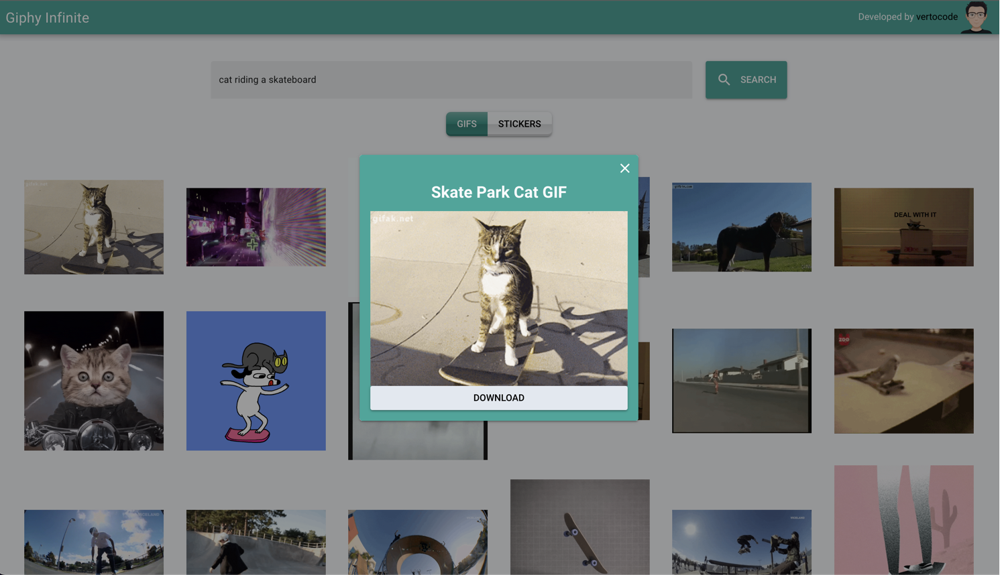

<h1 align="center"> <a href="https://giphy.vertocode.com" target="_blank">Giphy Infinite</a></h1>

<p align="center">
    <span>Made by vertocode with Vue + Quasar</span>
    <br />
    
</p>

## Principal Links
- [Deployed App 🚀](https://giphy.vertocode.com/)
- [Video Demo ▶️](https://www.youtube.com/watch?v=-AVa2KX0OtM)

## Jump To

- [Introduction](#introduction)
- [Features](#features)
- [Technologies](#technologies)
- [Installation](#installation)
- [Folder Structure](#folder-structure)
- [How to run e2e tests](#how-to-run-e2e-tests)
- [How to run lint](#how-to-run-lint)
- [License](#license)

# Introduction

Giphy Infinite is a web application that allows you to search for gifs using the Giphy API. It has a clean and simple interface, and it is also responsive. The app has infinite scroll, so you can keep scrolling and the app will keep loading more gifs. You can also click on a gif to see it in full size, and you can download the gif's to share it with your friends.

It was created as a challenge project for [SGBR](https://sgbr.com.br/) in a interview process.



# Features

- We can search for gifs or stickers using the Giphy API
- We can see the gifs or stickers in full size
- We can download the gifs or stickers
- We can see the gifs or stickers in an infinite scroll
- We can see the gifs or stickers in a responsive layout working on mobile, tablet and desktop
- We can see the loading state when the gifs or stickers are being loaded

# Technologies

- [Vue](https://vuejs.org/)
- [Quasar](https://quasar.dev/)
- [Typescript](https://www.typescriptlang.org/)
- [Pinia](https://pinia.esm.dev/)
- [Giphy API](https://developers.giphy.com/)
- [Axios](https://axios-http.com/)
- [Cypress](https://www.cypress.io/)
- [Tailwind CSS](https://tailwindcss.com/)
- [ESLint](https://eslint.org/)
- [Prettier](https://prettier.io/)

# Installation

1. Clone the repository
```sh
git clone git@github.com:vertocode/giphy-infinite.git
```

2. Install the dependencies (I'm using [bun](https://bun.sh/), but you can use other like npm or yarn)
```sh
cd giphy-infinite
bun i
```

3. Create a `.env` file in the root of the project and add the Giphy API key
```sh
VUE_APP_GIPHY_API_KEY=your-api-key
```

4. Run the app
```sh
bun dev
```

Now it should be able to access the app at `http://localhost:9000`. (If this port is already in use, will be used the next available port)

# Folder Structure

| Folder           | Description                                                                   |
|------------------|-------------------------------------------------------------------------------|
| /src             | The main application folder, where the app source are located.                |
| /src/assets      | aassets used in the platform are located.                                     |
| /src/boot        | Axios configuration is located.                                               |
| /src/components  | Almost all vue components are located. The ones that is not a layout or page. |
| /src/composables | Used to create custom composables.                                            |
| /src/css         | The default css configuration.                                                |
| /src/layouts     | Vue component used as a layout.                                               |
| /src/pages       | Vue component used as a page.                                                 |
| /src/router      | Vue router config.                                                            |
| /src/stores      | Store + config of Pinia.                                                      |
| /src/types       | Types used to TypeScript.                                                     |
| /src/utils       | Where is stored common functions.                                             |
| /cypress         | E2E Tests with Cypress.                                                       |
| /public          | Public images.                                                                |

# How to run e2e tests

1. Run the app
```sh
bun dev
```

You can run in headless or ui mode.

### Headless mode
```sh
bun cypress:run
```

### UI mode
```sh
bun cypress:open
```

# How to run lint

```sh
bun lint
```

# License

This project is licensed under the MIT License - see the [LICENSE](LICENSE) file for details.
